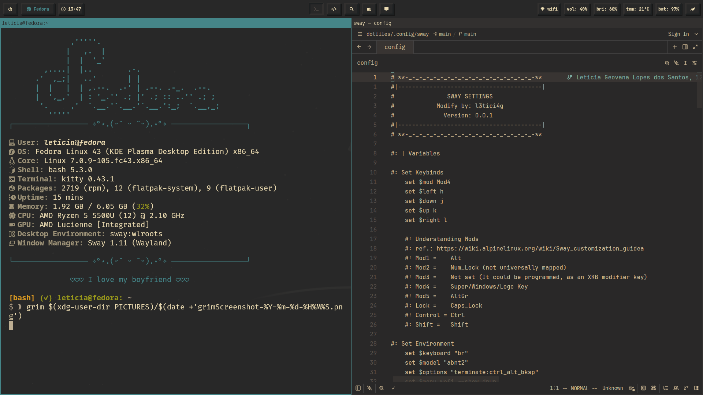

    <h1>˙✦ <i>l3tici4g's dotfiles for development</i> ✦˙</h1>
    <h3><u>Setup de desenvolvimento</u></h3>

 

Um setup no Fedora 43 utilizando o Sway como gerenciador de janelas para o Desenvolvimento de Sistemas para Internet.

# Implementações Futuras

- [ ] Aplicar regras específicas para as janelas das aplicações
- [ ] Ajustar a tela de bloqueio para quando suspender
- [ ] Adicionar e configurar o botão de Bluetooth no Waybar
- [ ] Mapear as dependências do dotfiles
- [ ] Criar um script shell de instalação dos programas
- [ ] Criar um script shell de limpeza do sistema
